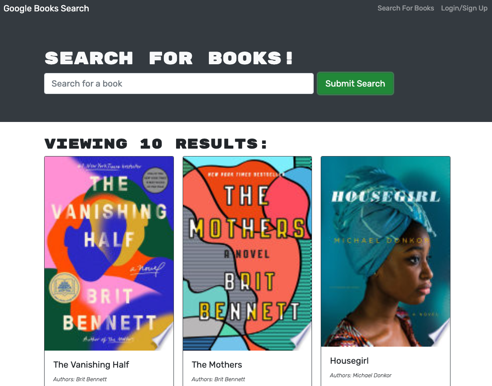

<!-- @format -->

# Book Search Engine

Designed for avid readers, the Book Search Engine allows users to utilze a search engine to find specific books. It also includes functionality to sign-up, log in, and save books to a favorites list. Users can reference their saved books, and remove books from their list as they choose. This MERN application is designed using GraphQL.

A link to the deployed application can be found here: https://apricot-cake-67612.herokuapp.com/

